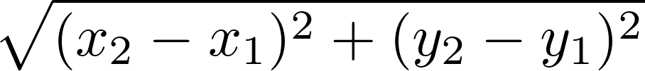

**Due**: Thur, Sept 17th by 11:59 PM

Acknowledgment: The idea for this assignment comes from [Tom Ellman](http://pages.vassar.edu/tomellman/) at Vassar College.

## Getting Started

Download [CS201\_Assign02\_Gradle.zip](CS201_Assign02_Gradle.zip) Extract the zip file and import it into Eclipse

> **File&rarr;Import...&rarr;Gradle&rarr;Existing Gradle Project**

You should see a project called **CS201\_Assign02\_Gradle** in the Package Explorer window.

## Your Task

Your task is to complete the implementation of the **Disk** class. (In the next assignment, you will use your **Disk** class to implement a game that will use this class.)

An instance of the **Disk** class represents one of the disks placed on the game board. Each **Disk** object should store the **x** and **y** coordinates of the disk's center, a **radius**, and a color (represented as member of the **DiskColor** enumeration). You should add fields to the class for each of these 4 properties.

You must implement 7 methods:

-   A constructor which initializes the fields of a newly-created **Disk** object using values specified by parameter values
-   A **getX** method which returns the **Disk** object's center x coordinate value
-   A **getY** method which returns the **Disk** object's center y coordinate value
-   A **getRadius** which returns the **Disk** object's radius value
-   A **getColor** method which returns the **Disk** object's color
-   An **overlaps** method which determines whether or not the **Disk** object overlaps another **Disk** object passed as a parameter
-   An **isOutOfBounds** method which determines whether or not the **Disk** object partly or completely lies outside the bounds of the rectangular game board

Each method is described by a comment which explains, in detail, how the method should work.

## Testing

In **src/test/java/(default package)** right-click on **DiskTest.java** and choose **Run As...&rarr;JUnit Test**. This will run the JUnit tests for the **Disk** class. If you have correctly implemented the **Disk** class, you will see a green bar, indicating that all tests have succeeded.

## Hints

The formula for computing the distance between two points is

> 

You can compute the square root of a **double** value using the **Math.sqrt** method.

## Grading

The assignment will be graded as follows:

* fields - 8%
* constructor - 10% 
* getX, getY, getRadius, getColor - 24%
* isOutOfBounds - 24%
* overlaps - 24%
* coding style - 10%

## Submitting

When you are done, submit the lab to the Marmoset server using either of the methods below.

### From Eclipse

If you have the [Simple Marmoset Uploader Plugin](../resources.html) installed, then right click on the project (**CS201\_Assign02\_Gradle**) and choose **Submit project...**. Enter your Marmoset username and password when prompted.

### From a web browser

Save the project (**CS201\_Assign02\_Gradle**) to a zip file by right-clicking it and choosing

> **Export...&rarr;Archive File**

Upload the saved zip file to the Marmoset server as **assign02**. The server URL is

> [https://cs.ycp.edu/marmoset/](https://cs.ycp.edu/marmoset/)

### After you submit

**Very important**: After you submit the assignment, please log into the [Marmoset server](https://cs.ycp.edu/marmoset) and check the files you submitted to make sure that they are correct.

*It is your responsibility to make sure that you have submitted your work correctly.*
