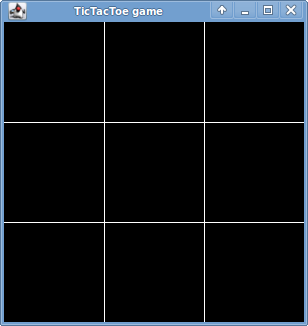
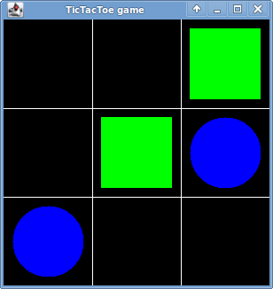

## Getting Started

Download [CS201\_Lab06\_Gradle.zip](CS201_Lab06_Gradle.zip). Extract the zip file and import it into Eclipse

> **File&rarr;Import...&rarr;Gradle&rarr;Existing Gradle Project**

You should see a project called **CS201\_Lab06\_Gradle** in the Package Explorer window.

## Your Task

Modify the program so that it allows a game of Tic Tac Toe to be played.

Instead of using X and O to represent the pieces, use green squares and blue circles.

The game board is 300 pixels wide by 300 pixels high. So, each square of the board should be 100x100 pixels.

Here is what the game board should look like when the program starts:

> 

When the left mouse button is clicked in a square, a green square should be placed. When the right mouse button is clicked in a square, a blue circle should be placed. Here is what the game board should look like after a few pieces have been placed:

> 

You do not need to be concerned with checking the legality of a move (i.e., whether there is a piece there already), or with detecting when the game is finished, although if you finish early you can try implementing these features for fun.

## Hints

In the **handleMouseClick** method, you can get the coordinates of the mouse pointer as follows:

    int x = e.getX();
    int y = e.getY();

You can check to see which mouse button was clicked as follows:

    if (e.getButton() == MouseEvent.BUTTON1) {
        // left button
        ...
    } else if (e.getButton() == MouseEvent.BUTTON3) {
        // right button
        ...
    }

## Submitting

When you are done, submit the lab to the Marmoset server using either of the methods below.

### From Eclipse

If you have the [Simple Marmoset Uploader Plugin](../resources/index.html) installed, then right click on the project (**CS201\_Lab06\_Gradle**) and choose **Submit project...**. Enter your Marmoset username and password when prompted.

### From a web browser

Save the project (**CS201\_Lab06\_Gradle**) to a zip file by right-clicking it and choosing

> **Export...&rarr;Archive File**

Upload the saved zip file to the Marmoset server as **lab06**. The server URL is

> [https://cs.ycp.edu/marmoset/](https://cs.ycp.edu/marmoset/)
